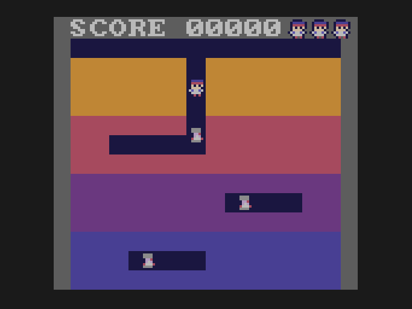
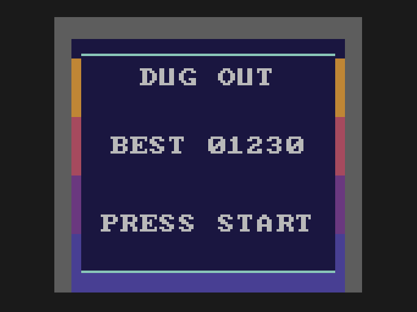

# Build a GameTank game

Notes on writing a game in C for the [GameTank](https://gametank.zone), an 8-bit console with a 65C02, a blitter, a four-voice FM
synthesiser and a cartridge slot. There are ten lessons that each add to one small game, a lesson on testing it with scripts, and a
tour of how the finished game, **Dug Out**, does some of the same things. Every lesson's program builds and runs.

**Status: a draft.** The lesson code is checked by building it and by scripted runs in the emulator. The explanations have not
been reviewed by anyone learning from them, and not every claim in them has been checked against the SDK. Expect gaps and some
mistakes, and please open an issue where you find one.

**This is not how Dug Out was built.** The lesson game is a simplified game written for teaching: one level, one kind of enemy, flat
colours. Dug Out grew over many versions and has much more (nine innings, five enemy types, a boss, textured dirt). The tour at the
end shows where the real game differs.

| 1 | 3 | 5 | 9 |
|---|---|---|---|
|  |  |  |  |

## The lessons

| | you build | you learn |
|---|---|---|
| [1. The screen](lessons/01-the-screen/README.md) | a bouncing box | the draw queue, the blitter, double buffering, vsync |
| [2. Sprites](lessons/02-sprites/README.md) | Doug, a Vumpire, a gold bar | sprite sheets, palettes, animation |
| [3. Moving Doug](lessons/03-moving-doug/README.md) | walking on a grid | input, cells, turning corners, 8-bit arithmetic |
| [4. Digging](lessons/04-digging/README.md) | dirt, tunnels, score | the map, drawing within the queue's limits, text |
| [5. Enemies](lessons/05-enemies/README.md) | caves, hunters | breadth-first search on a 6502, parallel arrays |
| [6. Throwing](lessons/06-throwing/README.md) | baseballs and strikes | collisions, small state machines, pools |
| [7. Sound](lessons/07-sound/README.md) | music and effects | the audio coprocessor, MIDI, `.sfx`, counting vsyncs |
| [8. Banks](lessons/08-banks/README.md) | (nothing new) | 16K banks, `code-name`, calling across banks |
| [9. Game flow](lessons/09-game-flow/README.md) | title, game over, saved best score | state machines, flash save |
| [10. Finishing touches](lessons/10-finishing-touches/README.md) | a gold bar; heads nodding on the beat | fixed-point time, effects locked to music |
| [11. Testing](lessons/11-testing/README.md) | (a test script) | driving the emulator, peek and poke, regression |
| [12. A tour of Dug Out](tour/README.md) | (reading) | how a finished game is organised |

## Using it

You need the [GameTank SDK](https://github.com/clydeshaffer/gametank_sdk) and whatever it needs (`cc65`, `make`, `node`,
`python3`, `zopfli`; see its README). Put the SDK in `./sdk` next to `build.sh`, or point `SDK_DIR` at a checkout you already have
(the lessons were written against commit `18b281f`). Then:

```bash
./build.sh lessons/01-the-screen        # builds bin/01-the-screen.gtr
```

Open `bin/01-the-screen.gtr` in a GameTank emulator, or put it on a cartridge. Every lesson builds the same way, and lesson *n*'s
code is lesson *n-1*'s code plus what the walkthrough describes (compare them with `diff`).

Lesson 11 (automatic testing) needs the [GameTank emulator](https://github.com/clydeshaffer/GameTankEmulator) with a small scripting patch; the lesson says how.

## How the repository works

* `lessons/NN-name/code/` holds only the files that differ from a fresh SDK project (`src/main.c`, `assets/`, `project.json`).
  `build.sh` copies the SDK to `build/`, lays the lesson on top, and runs the SDK's own `make`. Your SDK checkout is never touched.
* Lessons 7 to 10 use a one-line change to the SDK's interrupt code (a vsync counter); the build applies it from
  `tools/sdk_patch.py`, which edits the copy in `build/`. Lesson 7 explains why.
* The READMEs are written from `README.src.md` by `tools/snippets.py`, which pastes in the real code, so the text cannot drift from
  the programs. (`python3 tools/snippets.py --check` says if a README is out of date.)
* `art/make_art.py` draws the sprite sheet (run it with a lesson's folder, see its header), `tools/mkmidi.py` and `tools/mksfx.py` write the music and effects, and
  `tools/palette.py` finds palette numbers. You can swap any of it for your own.

## Credits

The GameTank is by Clyde Shaffer, and so are the [SDK](https://github.com/clydeshaffer/gametank_sdk) and the
[emulator](https://github.com/clydeshaffer/GameTankEmulator) this builds on; neither is included here.

## Licence

Everything in this repository (the text, the lesson programs, the art, the music and the tools) is licensed under the
[GNU General Public License v3.0](LICENSE). The SDK and emulator are not part of it and stay under their own terms.
