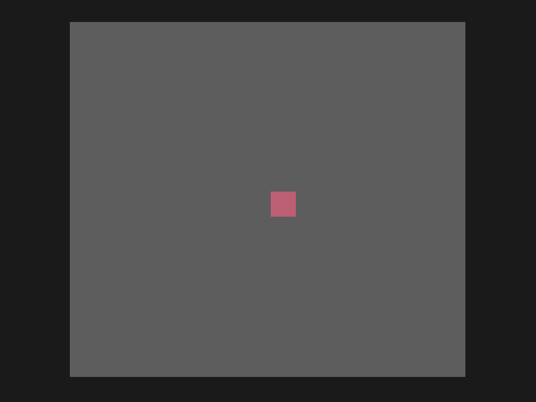

# Lesson 1: the screen

**You will build:** a box that bounces around a grey screen. It is five lines of game and a loop, and every later lesson sits on top of it.

**Run it:** `./build.sh lessons/01-the-screen`, then open `bin/01-the-screen.gtr` in a GameTank emulator (or put it on a cartridge).



## The program

```c
/*
 * Lesson 1: the screen.
 *
 * The smallest game loop there is: a box bounces around a grey screen. Everything later in the tutorial is built on this loop.
 */
#include "gt/gametank.h"
#include "gt/gfx/draw_queue.h"

char box_x = 30, box_y = 20;     /* where the box is (its top left corner) */
char dx = 1, dy = 1;             /* which way it is going: one pixel a frame */

void main(void)
{
    while (1) {
        /* Describe the picture. Nothing is drawn yet: these calls only add jobs to the "draw queue". */
        queue_clear_screen(3);                  /* fill the screen with palette colour 3, a mid grey */
        queue_draw_box(box_x, box_y, 8, 8, 92); /* an 8x8 box in colour 92 */
        queue_clear_border(0);                  /* the top 7 and bottom 8 rows of the 128x128 screen are not shown: paint them black */

        /* move the box, and bounce it off the edges of the visible area */
        box_x += dx;
        box_y += dy;
        if (box_x == 1) dx = 1; else if (box_x == 119) dx = -1;
        if (box_y == 8) dy = 1; else if (box_y == 112) dy = -1;

        await_draw_queue();      /* let the blitter finish the jobs */
        await_vsync(1);          /* wait for the TV to finish its frame, so nothing tears */
        flip_pages();            /* show what was just drawn, and draw the next frame on the page that was showing */
    }
}
```

## What is going on

**The screen is 128 x 128 pixels, but you only see 113 rows.** The top 7 and bottom 8 rows fall outside the part a TV shows, so the
game draws a black border over them (`queue_clear_border`) and keeps everything that matters inside rows 8 to 119. The boundaries
in the bounce (`box_y == 8`, `== 112`) come from that.

**Colours are one byte.** There are 256 of them and colour 0 means "transparent" when a sprite is drawn. You will not need to
memorise the numbers: `python3 tools/palette.py --grid` prints the whole palette as a chart, and `python3 tools/palette.py 237,178,98`
finds the nearest palette colour to any RGB value you give it. The lessons only use a handful.

**You do not draw directly; you queue jobs.** The GameTank has a *blitter*, a second chip that fills boxes and copies sprites
into the picture much faster than the 6502 could. The SDK's *draw queue* is a list of jobs for it: `queue_clear_screen`,
`queue_draw_box` and later `queue_draw_sprite` only add to the list, and the blitter works through it in the background while your
code carries on. Two rules follow:

1. Call `await_draw_queue()` before you rely on the picture being finished.
2. Never queue so much that the list overflows. It holds 250 jobs (`QUEUE_MAX`), which sounds like plenty until the playfield is a
   grid of sprites. Lesson 4 has a way around it.

**Two pictures, one shown.** The console has two frame buffers. While the TV shows one, you draw the next on the other, and
`flip_pages()` swaps them. That is why `flip_pages` comes last, and why `await_vsync` (wait for the TV to finish its frame) comes
just before it: flipping in the middle of a frame would tear the picture.

**Order matters inside the frame.** Clear first, draw things in the order they should overlap (later jobs cover earlier ones),
border last.

## Try it

* Change the box size or colour. Which numbers make the bounce stop working, and why?
* `await_vsync(2)` instead of `(1)` halves the speed. The game you are building runs at 30 frames a second, which is that.
* Add a second box that bounces the other way.

Next: [lesson 2, sprites](../02-sprites/README.md).
