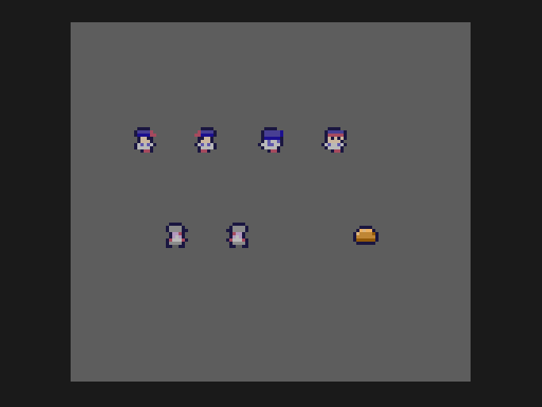

# Lesson 2: sprites

**You will build:** the cast of the game on screen: Doug facing every way, a Vumpire, and a gold bar, with walking animation.



## Drawing the art

The game's art is made by a short script, `art/make_art.py`, which writes `spr.bmp` (a 128 x 128, 256-colour bitmap, one 8 x 8 cell
for every picture) and `art.h` (where each picture sits on the sheet). Look at the script: each picture is a few rows of text,
one character per pixel, mapped to palette colours. Editing a character and re-running the script is the whole art pipeline, and
needs no paint program. If you prefer a paint program, draw the sheet by hand and write `art.h` yourself.

The sheet goes in the project as `assets/spr/spr.bmp`. `make import` (which `build.sh` runs for you) converts it, with the
SDK's tools, into a file in the cartridge and a C name for it (`ASSET__spr__spr_bmp_load_list`).

## The program

```c
/*
 * Lesson 2: sprites.
 *
 * Draws Doug (facing right, left, up and down), a Vumpire and a gold bar from a sprite sheet, with the walking frames animated.
 */
#include "gt/gametank.h"
#include "gt/gfx/draw_queue.h"
#include "gt/gfx/sprites.h"
#include "gen/assets/spr.h"      /* made by "make import" from assets/spr/spr.bmp: the name of the sheet in C */
#include "art.h"                 /* made by art/make_art.py: where each frame sits on the sheet */

#define COL_BG 3                 /* a mid grey from the palette: (hue 0, brightness 3) */

SpriteSlot slot_spr;             /* which of the GameTank's sprite memory pages holds our sheet */
unsigned char frame_ct;          /* counts frames, so that things can animate */

/* Draw the 8x8 piece of the sheet at (gx, gy) with its top left corner at (x, y) on the screen. */
void sprite(unsigned char x, unsigned char y, unsigned char gx, unsigned char gy)
{
    queue_draw_sprite(x, y, SPR_W, SPR_W, gx, gy, slot_spr);
}

void main(void)
{
    unsigned char d, f;

    /* copy the sheet from the cartridge into sprite memory (this takes a moment, so do it before the loop) */
    slot_spr = allocate_sprite(&ASSET__spr__spr_bmp_load_list);

    while (1) {
        ++frame_ct;
        queue_clear_screen(COL_BG);

        /* Doug facing each way. The walking frame flips every 8 frames: frame number = direction * 2 + step */
        f = (frame_ct >> 3) & 1;
        for (d = 0; d < 4; ++d)
            sprite(20 + d * 20, 40, doug_x[d * 2 + f], doug_y[d * 2 + f]);

        /* the same thing for a Vumpire (it only has left and right) */
        for (d = 0; d < 2; ++d)
            sprite(30 + d * 20, 70, vamp_x[d * 2 + f], vamp_y[d * 2 + f]);

        /* and a gold bar, which does not move */
        sprite(90, 70, GOLD_GX, GOLD_GY);

        queue_clear_border(0);
        await_draw_queue();
        await_vsync(1);
        flip_pages();
    }
}
```

## What is going on

**Sprites live in a separate memory, not in the picture.** The blitter copies from "graphics RAM" to the screen. Before you can
draw a sprite you have to copy the sheet into graphics RAM, which is `allocate_sprite`: it returns a *slot* that you pass to every
`queue_draw_sprite`. A 128 x 128 sheet takes a quarter of one page, and the slot remembers which quarter. That copy takes a
moment (it is a few thousand bytes), so it is done before the loop, not in it.

**`queue_draw_sprite(x, y, w, h, gx, gy, slot)`** copies a `w` x `h` rectangle whose top left corner is at `(gx, gy)` on the sheet
to `(x, y)` on the screen. Colour 0 is transparent: that is how a round sprite sits on a background.

**Animation is arithmetic.** Each direction has two walking frames on the sheet, laid out one after the other, so frame number is
`direction * 2 + step`, and `step` flips every 8 frames: `(frame_ct >> 3) & 1`. The tables `doug_x`, `doug_y`, `vamp_x`,
`vamp_y` in `art.h` say where each frame is.

## Gotchas

* `queue_draw_sprite` is a *macro* that expands to several statements. In a `for` or `if` without braces only the first of them is
  repeated or skipped, and the symptom is a stray sprite and missing ones, not an error. Always give it braces, or (as here) wrap
  it in a function of your own.
* Draw order is still queue order. The border goes last.

## Try it

* Draw a different enemy in `make_art.py` and put it on the sheet next to the others.
* Make the Vumpire walk across the screen. Remember the flip between left and right.

Next: [lesson 3, moving Doug](../03-moving-doug/README.md).
