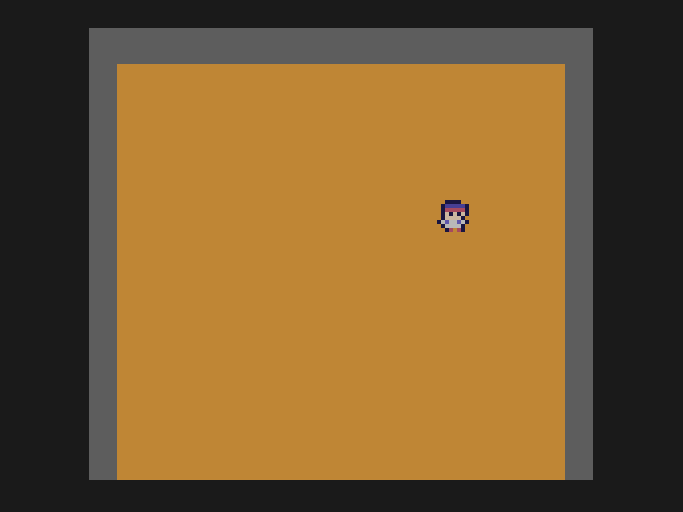

# Lesson 3: moving Doug

**You will build:** Doug walking around a field with the d-pad, one pixel per frame, turning corners the way tunnel games do.

## Input

{{file 03-moving-doug src/main.c}}

## What is going on

**Reading the pad.** `update_inputs()` reads both controllers, once per frame, into `player1_buttons` and
`player1_new_buttons` (the second has a bit only on the frame a button went down: use it for "press start"). The bits are tested
with the `INPUT_MASK_` constants.

**The field is a grid.** 14 columns by 13 rows of 8 x 8 cells, starting at (8, 16) on the screen. Doug's position is kept in
pixels relative to the field, not the screen, which makes the cell he is in simply `(px >> 3, py >> 3)`: a shift by three is a
divide by eight, and on a 6502 a shift is nearly free while division is a subroutine.

**Turning corners.** Doug is allowed to turn only when he is exactly on a cell boundary, otherwise he would clip the corner of the
dirt. If you push sideways while he is between lanes, he walks on to the nearer lane first and turns when he gets there; the
`misal` code does that. This is the single most "feel"-defining piece of a game like this: try deleting the check and play it.

**Eight bits.** Positions here fit in a `char`, which is why they are `unsigned char`. The field is at most 112 pixels wide, so
nothing overflows, and the 6502 handles bytes much faster than 16-bit `int`s. Habit to learn: use `unsigned char` unless you have a
reason not to, and think about wraparound (`0 - 1 = 255`) whenever you subtract.

## Try it

* Make Doug faster (move 2 pixels per frame) and see which of the lane assumptions break.
* Make the field wrap at the edges.

Next: [lesson 4, digging](../04-digging/README.md).
