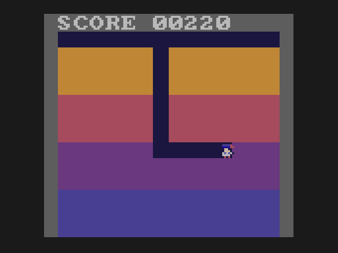

# Lesson 4: digging

**You will build:** the field turns into dirt that Doug digs as he walks, paid by depth, with a score on screen.

## The map

{{fn 04-digging new_map}}

The map is one byte per cell: 1 is dirt, 0 is tunnel. It has 16 bytes to a row (not 14), so that a cell is
`map[(row << 4) | column]`: again shifts instead of a multiply. The two spare columns and the extra row are "outside" (always
dirt in this lesson, so nothing wanders into them).

## Digging

{{fn 04-digging update_player}}

Two new ideas in there. Dirt **slows** Doug to every other frame (look at the cell just ahead of him, `LEADX`/`LEADY`), so digging
feels heavy and running along an existing tunnel feels fast. And on every step the cell under his middle is cleared, and he is
paid for it: 10 points near the top, rising to 40 at the bottom.

## Drawing a field that does not fit in the queue

The field is 182 cells, and the draw queue holds 250 jobs. Drawing each cell as a sprite would eat the queue before anything else.
So the field is drawn as **a few big boxes**: four boxes for the four layers of dirt, then one box for each run of
tunnel cells in a row, drawn on top.

{{fn 04-digging draw_field}}

## Text

{{fn 04-digging draw_score}}

The SDK's text module draws characters straight to the screen, not through the queue, so it must run after
`await_draw_queue()` and before `flip_pages()`. It also needs its font loaded into sprite memory *before* your own sheet:

> **Gotcha.** If the first thing you load is your sheet, the text does not show. A 128 x 128 sheet takes a quarter of a sprite
> page, and its slot number says which quarter. The SDK's text routine copies the font's slot number into a hardware register without
> masking off the quarter bits, so it only works when the font is in the first quarter, which is where the first sheet loaded goes.
> Load the font (`text_load_font`) and then your own sheet.

## Try it

* Add a second layer colour and make the deep dirt harder (slower) to dig.
* Make the score count only the first time a cell is dug.

Next: [lesson 5, enemies](../05-enemies/README.md).
