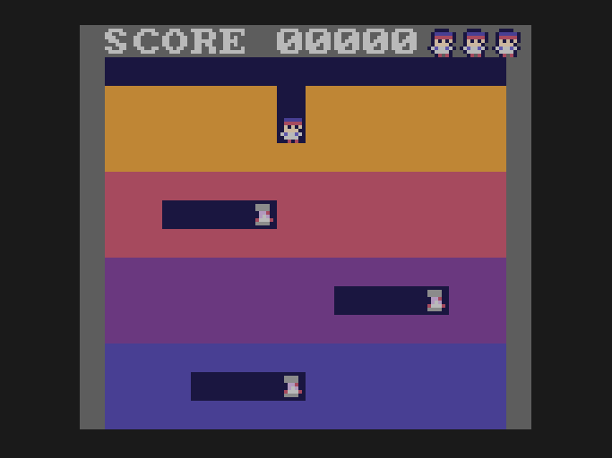

# Lesson 5: enemies

**You will build:** three Vumpires, each sealed in a cave. They stay put until Doug's tunnel reaches them, then they find the way to
him and walk it. If one touches Doug he loses a life.

| sealed | hunting |
|---|---|
|  |  |

## Many things with the same fields

Three enemies, each with a position, a direction, and so on. The natural C is an array of structs. On a 6502 it is the wrong
tool: reaching the field of element `i` of an array of structs means multiplying `i` by the struct size, and cc65 has no
multiply instruction to use. So the fields are kept in **parallel arrays**, one per field (`e_x[i]`, `e_y[i]`, `e_dir[i]`):
element `i` is then just `base + i`.

## Finding the way: breadth first search

{{fn 05-enemies bfs_dir}}

A Vumpire cannot dig, so the only way to Doug is through open tunnel. The search starts at the Vumpire and looks at its
neighbours, then their neighbours, ring by ring. The first time it reaches Doug's cell, the number of rings is the shortest
distance. For every cell reached it writes down *which step got it there*, so when it arrives it can walk that trail backwards to
the very first step, which is all the Vumpire needs to know. No path (the cave is sealed): it returns 0.

The whole map is 14 x 13, so one search is a few hundred instructions at most, and an enemy only searches when it is exactly on a
cell (every 8 pixels), so there is no need for anything cleverer.

{{fn 05-enemies choose_dir}}

If there is no way, the Vumpire wanders: any open neighbour except the one it came from. The result is an enemy that rattles
around in its cave until the day Doug breaks in, and that is the behaviour that makes the game tense.

## Speed

{{fn 05-enemies update_enemies}}

Each Vumpire adds `ESPEED` (9) to a counter every frame and steps when the counter reaches 16: that is 9/16 of a pixel a frame, a
bit over half of Doug's speed, with no division and no fractions. This pattern, "an accumulator and a threshold", is how you get
speeds that are not whole pixels on hardware with no decimals. You will use it again for the beat in lesson 10.

## Gotchas

* **Signed vs unsigned.** `open_cell(c, r)` takes `signed char`s. Column `-1` would be `255` as a byte and look like a valid cell
  far off the edge. The casts in the code are there for that.
* **The recursion you did not write.** Search by recursion would overflow the 6502's tiny stack (it is 256 bytes shared with
  everything); the queue is a plain array instead.

## Try it

* Give each Vumpire a different speed.
* Have the Vumpires prefer to wander toward Doug even when there is no path.

Next: [lesson 6, throwing](../06-throwing/README.md).
