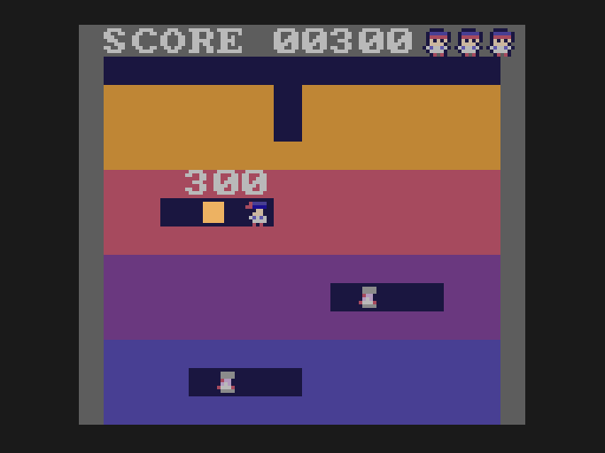
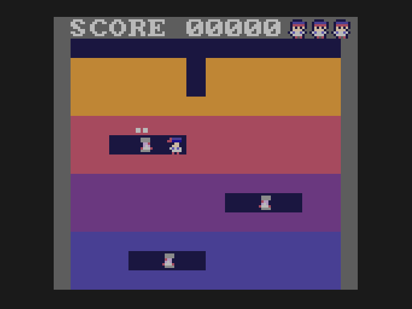

# Lesson 6: throwing

**You will build:** Doug throws baseballs with button A. Three hits put a Vumpire out and score by depth. A Vumpire that is stunned is
still deadly to touch, so a hit buys a moment, not safety.

| in flight | a strike |
|---|---|
|  |  |

## The ball

{{fn 06-throwing ball_step}}

The ball moves 4 pixels per frame, as **two steps of 2**. A Vumpire is 8 pixels wide and the hit window is 6, so a ball that
moved 8 at once could jump straight over one. Whenever something fast has to collide with something small, move it in steps
smaller than the target. The same loop checks dirt (the ball stops at it) and range (it falls after 40 pixels).

## A strike

{{fn 06-throwing strike}}

Each enemy has a small state machine: walking, struck (`ES_INFL`, stunned), or put out (`ES_POP`, showing its popup). The
`e_infl` count is how many strikes it has taken. The scoring by depth uses the same layers as the digging.

## Score popups

{{fn 06-throwing add_popup}}

Popups are another small pool: two slots, reuse a free one or take over the oldest. A fixed pool is the usual way to do "many
short-lived things" without ever allocating.

## Try it

* Let Doug have two balls in the air.
* Make a stunned Vumpire recover faster each time.

Next: [lesson 7, sound](../07-sound/README.md).
