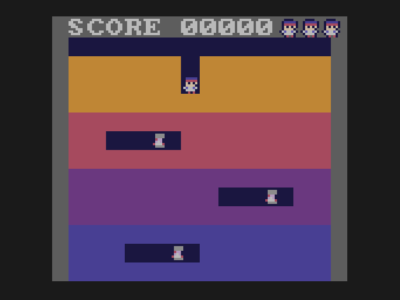

# Lesson 7: sound

**You will build:** a looping tune and five sound effects (dig, throw, strike, put out, caught), and an engine tweak that keeps the
music in time.



## How the GameTank makes sound

Sound has its own processor, a second 6502 with its own RAM, running a small program the SDK ships: a four-voice software FM synthesiser
(each voice is four "operators" that modulate one another). The main CPU never makes noise itself: it
**writes requests into a shared page of that RAM** (`$3000-$3FFF`), and the sound CPU does the rest. On the main side the SDK
gives you:

* `play_song(song, REPEAT_LOOP)`, a MIDI tune
* `play_sound_effect(id, channel | SFX_PRIORITY(p))`, a one-shot effect
* `tick_music()`, which you must call **once per vsync** to advance the tune

The file `assets/audio/asset.cfg` says which FM instrument each MIDI channel uses; `make import` converts the `.mid` and `.sfx` files
and writes `gen/assets/audio.h` with their names (`ASSET__audio__theme_mid`, `ASSET__audio__die_sfx_ID`).

### Making the audio without a tracker

`tools/mkmidi.py` writes `theme.mid`, a plain MIDI file, from note lists in a script. `tools/mksfx.py` writes the effects. A `.sfx` is
just a few bytes per tick (volumes and notes of the four operators); the file format is spelled out at the top of the script. Read
them: both are short, and you can replace them with any MIDI file and any sfx you like.

## Priorities

```c
/* Sound effects all play on one of the console's four sound channels (channel 3), so a new effect cuts off the one before it.
 * The priority (0-15) decides who wins: an effect only starts if its priority is at least that of the one already playing. */
#define SFX_CH 3
#define SFX(id, priority) play_sound_effect(id, SFX_CH | SFX_PRIORITY(priority))
```

Effects share one of the four voices (channel 3), so a new effect would cut off the one playing. The priority decides who wins:
getting caught (4) beats everything, putting a Vumpire out (3) beats the hit it follows (2), and a dig (0) never interrupts anything.

## The tune drags! (and the fix)

The game runs at 30 frames a second, but the music needs 60 ticks a second. So the loop calls `tick_music()` twice a frame, once after
each vsync. That is fine until a frame takes longer than two vsyncs (a busy frame when several Vumpires are on screen is enough):
`await_vsync` then returns at the *next* vsync it sees, and the one that passed in the middle is never counted, so the tune slows
down by exactly the frames you lost. The SDK has no way to count vsyncs, so this lesson adds one with a tiny patch to the SDK's
copy that the build applies for you (`sdk-patches` and `tools/sdk_patch.py`): the NMI handler, which runs on every vsync, adds one
to a byte in the shared sound RAM.

```c
/* The SDK keeps no count of vsyncs, so lesson 7 adds one (see sdk-patches and tools/sdk_patch.py): the NMI handler adds one to the byte
 * at $3210 on every vsync, whatever the game is doing. music_poll() looks at how many arrived since it last looked and gives the music
 * player that many ticks, so the tune keeps time even when a frame takes longer than planned. It returns the number of vsyncs. */
#define vsync_raw (*(volatile unsigned char *)0x3210)
unsigned char music_seen;
unsigned char music_poll(void)
{
    unsigned char n = vsync_raw - music_seen, k;
    music_seen += n;
    for (k = n; k; --k) tick_music();
    return n;
}
```

`music_poll()` ticks the music once for every vsync that actually went by, however many that was. In the main loop it replaces
`tick_music`:

```c
        await_vsync(2);
        music_poll();
```

> **Why in the sound RAM and not an ordinary variable?** The draw queue keeps its lists in a second bank of RAM which the
> program switches in for a few instructions at a time, many times a frame. If the NMI arrives in one of those moments, a normal
> variable would be written to the wrong bank. The shared page is the same whichever bank is switched in.

## Gotchas

* **Don't wait for the music inside a frame**; always count real vsyncs, as above.
* The effect IDs and `ASSET__...` names come from file names: renaming `die.sfx` changes the name in your code.
* A sound effect that is not at least as important as the one already playing is simply dropped: if an effect never plays,
  look at its priority.

## Try it

* Change the instrument numbers in `asset.cfg` and listen.
* Write a longer tune (`mkmidi.py` has the notes as a list).

Next: [lesson 8, banks](../08-banks/README.md).
