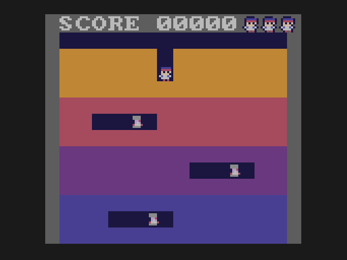
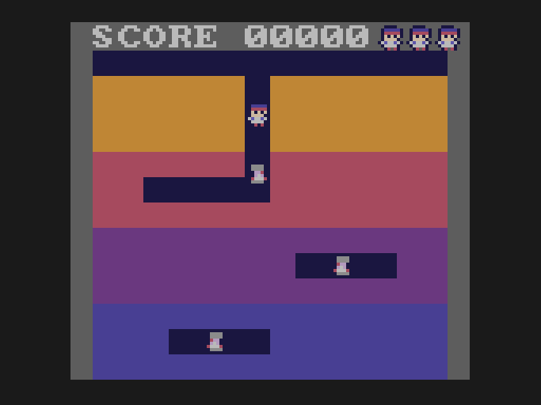

# Lesson 8: banks

**You will build:** nothing new on screen. The same game as lesson 7, laid out differently in the cartridge so it can grow beyond the
processor's 64K.

| sealed | hunting |
|---|---|
|  |  |

## Why

The 6502 can only see 64K at once and a GameTank cartridge can be 2M. The cartridge is cut into 16K **banks**. One bank at a time is
switched into the window at `$8000-$BFFF`; the top 16K (`$C000-$FFFF`, the **fixed bank**) is always there, and is where the SDK's
code, the interrupt handlers and the first thing that runs live.

In `project.json`, `"progbanks": 2` asks the build for two program banks (`PROG0` and `PROG1`) besides the fixed one and the
sound/graphics ones, and `make import` writes `gen/bank_nums.h` with their numbers.

```json
{
    "title": "My GameTank Game",
    "romname": "game.gtr",
    "progbanks": 2,
    "modules": [
        "PERSIST",
        "RANDOM",
        "TEXT",
        "DRAWQUEUE",
        "PADDLEINPUT",
        "AUDIO_DEFAULT_FM"
    ]
}
```

## Putting code in a bank

`#pragma code-name` tells the compiler where the code that follows goes:

```c
#pragma code-name (push, "PROG1")      /* from here until the matching pop, functions go into the PROG1 bank */

/* -------------------------------------------------- finding the way: BFS -- */

/* A breadth first search from the enemy's cell: look at every neighbour, then their neighbours, and so on, ring by ring, so the
 * first time the search reaches the goal it has found a shortest way. For every cell it reaches it remembers which step led there
 * (1 to 4), and when it gets to the goal it walks that trail back to find the very first step. */
unsigned char trail[(ROWS + 1) << 4];     /* 0 = not reached yet, otherwise 1 + the direction of the step that reached this cell */
unsigned char queue[(ROWS + 1) << 4];     /* the cells still to look at */

unsigned char bfs_dir(unsigned char i, unsigned char goal)
{
    unsigned char head = 0, tail = 0, cur, c, r, d, nc, nr, n, start, first = 0;
    for (n = 0; n < sizeof trail; ++n) trail[n] = 0;
    start = ((e_y[i] >> 3) << 4) | (e_x[i] >> 3);
    queue[tail++] = start; trail[start] = 5;
    while (head != tail) {
        cur = queue[head++]; c = cur & 15; r = cur >> 4;
        if (cur == goal && cur != start) {
            while (cur != start) {                       /* walk the trail back to the start */
                d = trail[cur] - 1; first = d;
                cur = (unsigned char)(((((signed char)(cur >> 4)) - DY[d]) << 4) | (((signed char)(cur & 15)) - DX[d]));
            }
            e_dir[i] = first;
            return 1;
        }
        for (d = 0; d < 4; ++d) {
            nc = c + DX[d]; nr = r + DY[d];
            if (!open_cell((signed char)nc, (signed char)nr)) continue;
            n = (nr << 4) | nc;
            if (trail[n]) continue;
            trail[n] = d + 1;
            queue[tail++] = n;
        }
    }
    return 0;
}

/* An enemy is exactly on a cell: pick its next direction. */
void choose_dir(unsigned char i)
{
    unsigned char c = e_x[i] >> 3, r = e_y[i] >> 3, d, n = 0, opt[4];
    unsigned char goal = (((py + 4) >> 3) << 4) | ((px + 4) >> 3);

    if (bfs_dir(i, goal)) return;                        /* there is a way to Doug: take it */

    /* no way (the cave is sealed): wander. Pick any open neighbour except the one behind, or turn back at a dead end. */
    for (d = 0; d < 4; ++d)
        if (d != (e_dir[i] ^ 1) && open_cell((signed char)(c + DX[d]), (signed char)(r + DY[d]))) opt[n++] = d;
    if (n) e_dir[i] = opt[rng() % n];
    else   e_dir[i] = e_dir[i] ^ 1;
}

void update_enemies(void)
{
    unsigned char i, d;
    for (i = 0; i < MAXE; ++i) {
        if (e_state[i] == ES_INFL) {                     /* stunned: frozen, until the strike wears off */
            if (++e_timer[i] > 90) {
                e_timer[i] = 0;
                if (--e_infl[i] == 0) e_state[i] = ES_WALK;
            }
            continue;
        }
        if (e_state[i] == ES_POP) {                      /* just put out: show it for a few ticks, then it is gone */
            if (++e_timer[i] > 8) e_state[i] = ES_NONE;
            continue;
        }
        if (e_state[i] != ES_WALK) continue;
        e_acc[i] += ESPEED;
        if (e_acc[i] < 16) continue;                     /* not this tick */
        e_acc[i] -= 16;
        if (!((e_x[i] | e_y[i]) & 7)) choose_dir(i);     /* only on a whole cell can an enemy choose where to go */
        d = e_dir[i];
        e_x[i] += DX[d]; e_y[i] += DY[d];
        if (d < 2) e_face[i] = d;
    }
}

/* Does any enemy overlap Doug? */
unsigned char enemy_touches_doug(void)
{
    unsigned char i;
    for (i = 0; i < MAXE; ++i)
        if ((e_state[i] == ES_WALK || e_state[i] == ES_INFL) && absdiff(e_x[i], px) < 6 && absdiff(e_y[i], py) < 6) return 1;
    return 0;
}

#pragma code-name (pop)
```

(Everything between the two pragmas, including the helpers `open_cell` and `bfs_dir`, lands in PROG1; the game itself is in PROG0.)

## Calling across banks

A function in PROG1 can only be called while PROG1 is switched in, and the caller is in PROG0, in the same window. So a call has to
switch banks, call, and switch back, and it must be done by code that is *not* in the window: code in the fixed bank. That is
`bank_call` in `bank_call.s` (read it: it is twenty lines of assembler that saves A and X, switches, calls, restores, switches back),
and cc65 can be told to route calls to chosen functions through it:

```c
void bank_call(void);
#pragma wrapped-call (push, bank_call, BANK_PROG1)
void update_enemies(void);
unsigned char enemy_touches_doug(void);
#pragma wrapped-call (pop)
```

After that, `update_enemies()` is called like any other function. The compiler emits a call to `bank_call` with the target bank and
address; you do not see it.

## The one thing in the fixed bank

```c
void main(void)
{
    change_rom_bank(BANK_PROG0);
    game_main();
}
```

`main` switches PROG0 in and runs the game. Anything that must be reachable from every bank (like helpers that read other banks'
data, as lesson 9 will do) goes in the fixed bank too, which is simply code that has no `code-name` pragma.

## Gotchas

* **Function pointers across banks.** A pointer to a function in another bank is only good while that bank is switched in. Call
  through the wrapped declaration (above), not through a stored address.
* The fixed bank is small. It is shared with the SDK, so put your code in PROG banks and keep only the glue there.
* Anything that is not in the window's bank when you read it will read as some other bank's bytes. If code in one bank reads
  something in another, the second must be switched in (as `save_peek` does in lesson 9).

## Try it

* Add `"progbanks": 3` and move the drawing code into its own bank.
* What happens if you remove the pair of `wrapped-call` pragmas?

Next: [lesson 9, game flow](../09-game-flow/README.md).
