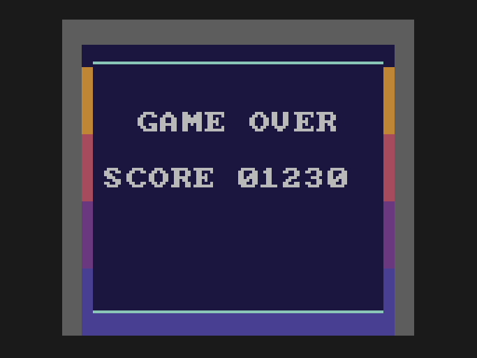

# Lesson 9: game flow

**You will build:** a title screen, a pause when Doug is caught, a game over screen, and a best score that survives switching the
console off.

| title | game over | title again |
|---|---|---|
|  |  |  |

## A state machine in a switch

```c
enum { ST_TITLE, ST_PLAY, ST_DYING, ST_OVER };         /* what the whole game is doing right now */
```

Everything the game can be doing is one value, `state`. The main loop does `switch (state)`: one case per screen, each with its own
update, and the drawing looks at `state` too. A `state_timer` counts frames since the state began, which is all you need for
"stay on this screen for a second", "ignore the button for half a second so the player does not skip the screen by accident" and
"flicker for a moment".

```c
void play_tick(void)
{
    update_player();
    update_enemies();
    if (score > best_score) { best_score = score; new_best = 1; }  /* beating the best score counts from the moment you pass it */
    if (enemy_touches_doug()) {
        SFX(ASSET__audio__die_sfx_ID, 4);
        state = ST_DYING; state_timer = 0;
    }
    if (enemies_left == 0) { new_map(); reset_positions(); }       /* every Vumpire is out: a fresh field */
}
```

## Saving to the cartridge

A GameTank cartridge is flash memory, and the SDK's `persist` module can rewrite one sector of it. You use `clear_save_sector` and
`save_write`.

```c
void save_best(void)
{
    if (best_score <= saved_best) return;                          /* nothing new to save */
    await_draw_queue();                                            /* the blitter must be idle: the flash write takes a moment */
    sbuf[0] = 0x44; sbuf[1] = 0x55;
    sbuf[2] = (unsigned char)(best_score & 0xFF);
    sbuf[3] = (unsigned char)(best_score >> 8);
    sbuf[4] = sbuf[2] ^ sbuf[3] ^ 0xA5;
    clear_save_sector();                                           /* flash must be erased before it is written */
    save_write(sbuf, (void*)0x8000, 5);                            /* the save sector appears at $8000 */
    saved_best = best_score;
}
```

Flash can only be written after being erased, and erasing takes a noticeable moment, so you save at the one moment nobody is
playing: when the game ends. The five bytes are two marker bytes (a never-written sector reads as `FF`s), the score, and a check
byte, so a damaged or empty save is recognised and ignored rather than shown as a score of 62000.

```c
void load_best(void)
{
    unsigned char lo, hi;
    saved_best = 0;
    if (save_peek(0) != 0x44 || save_peek(1) != 0x55) return;      /* never saved: there is no best score */
    lo = save_peek(2); hi = save_peek(3);
    if (save_peek(4) != (unsigned char)(lo ^ hi ^ 0xA5)) return;   /* damaged: ignore it */
    saved_best = ((unsigned int)hi << 8) | lo;
    best_score = saved_best;
}
```

### Reading the save from the right bank

The save sector sits in its own ROM bank. To read it, that bank must be switched into the `$8000` window, which is where the game's code
(PROG0) is. Switching the window out from under running code would crash, so the read is a function in the **fixed bank**:

```c
unsigned char save_peek(unsigned int off);              /* reads a byte of the saved data: defined at the end of the file, in the fixed bank */

/* ----------------------------------------------------------------- banks -- */
/* The functions below live in PROG1. Declaring them inside a wrapped-call block makes the compiler send every call to them
 * through bank_call (in bank_call.s, in the fixed bank), which switches PROG1 in, makes the call, and switches back. */
void bank_call(void);
#pragma wrapped-call (push, bank_call, BANK_PROG1)
void update_enemies(void);
unsigned char enemy_touches_doug(void);
#pragma wrapped-call (pop)

/* The helpers that every bank uses stay in the fixed bank (the default for code with no pragma), so they can be called from
 * anywhere without switching. */
unsigned char rng(void)
{
    lfsr = (lfsr >> 1) ^ (-(lfsr & 1) & 0xB400u);
    return (unsigned char)lfsr;
}
```

> **Gotcha.** The persist module's calls also switch banks, so `save_best` and `load_best` must be called from code that is *not*
> in the fixed bank (they are in PROG0 here). Calling them from the fixed bank switches the code away mid-call.

## Testing it

The emulator keeps the save in a file next to the ROM (`<rom>.xor`), so a test can do two runs and prove the score survives:
`test.txt` plays a game, scores 1230, and ends it; `test-second-run.txt` starts the ROM again and checks `best_score`. Lesson 11 is about how
that works.

## Try it

* Save the three best scores instead of one.
* Add a "NEW BEST!" flash when you pass the old best, not only at the end.

Next: [lesson 10, finishing touches](../10-finishing-touches/README.md).
