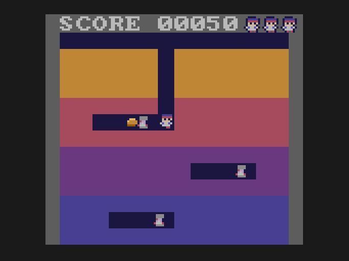

# Lesson 10: finishing touches

**You will build:** a treasure to hunt (a gold bar worth 500, hidden in a random cave), and Doug and the Vumpires nodding their
heads on every beat of the music while they walk.

## The gold bar

It is placed in a random cell of a random cave when the field is built, drawn under everything that moves (a Vumpire can walk over
it; only Doug can pick it up), and collected when Doug's middle is in its cell:

{{lines 10-finishing-touches ^    i = rng\(\) % MAXE;|gold_on = 1;}}

{{lines 10-finishing-touches ^    /\* the gold bar: enemies walk over it|^    [}]}}

## The beat

The tune is 126 beats a minute. The game counts time in vsyncs (60 a second), so a beat is 3600 / 126 = **28.57** vsyncs: not a whole
number. If you count whole vsyncs and wrap at 28 (or 29) the head nod slides out of time with the music within a few seconds.
So the beat is kept as a **fixed-point number**: `beat_acc` counts 256ths of a vsync, a whole vsync adds 256, and a beat is
`28.57 * 256 = 7314` of them. The 6502 has no decimals, but a count of 256ths is a perfectly good one.

{{lines 10-finishing-touches ^#define BEAT_FP|^unsigned char bob}}

Every frame, add the vsyncs that *really* went by (`music_poll()` counts them, lesson 7), wrap at a beat, and nod for the first
6 vsyncs of every beat. When the song loops (every 914 vsyncs, 32 beats) it starts the beat again from the exact point the song is at.

{{lines 10-finishing-touches ^        vs = music_poll|bob = \(state}}

## Nodding heads

A nod is a one-pixel drop of the top five rows of the sprite. That is two blits (body, then head a pixel lower, over it) instead of one:

{{fn 10-finishing-touches sprite_nod}}

And it should only happen while the sprite is moving: each walker has a "ticks left in which it counts as moving" counter that
`sprite_nod` is told about.

> **Gotcha.** You cannot get both "keeps strict time with the music" *and* "stops the moment the walker stops". The head's
> position is a function of the music, so when the walker stops, the head is either mid-nod (looks like a glitch) or has to jump to
> the top (looks like a twitch). The compromise here is a short grace period: a walker counts as moving for a few ticks after each step
(`e_mv`, `pmv`), so the nod does not flicker between steps.

## Testing the beat

`test-beat.txt` reads the `bob` variable every frame for a few hundred frames; you should see it switch on about every 28 or 29 frames while
the game is in play. (`tools/drive.py` is lesson 11.)

## Try it

* Make the enemies nod on the off-beat.
* Make the gold bar glitter on the beat.

Next: [lesson 11, testing](../11-testing/README.md).
